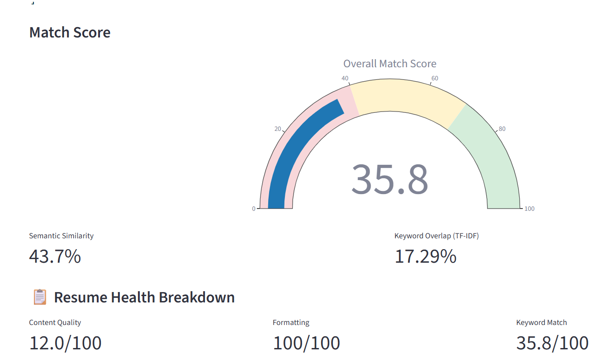
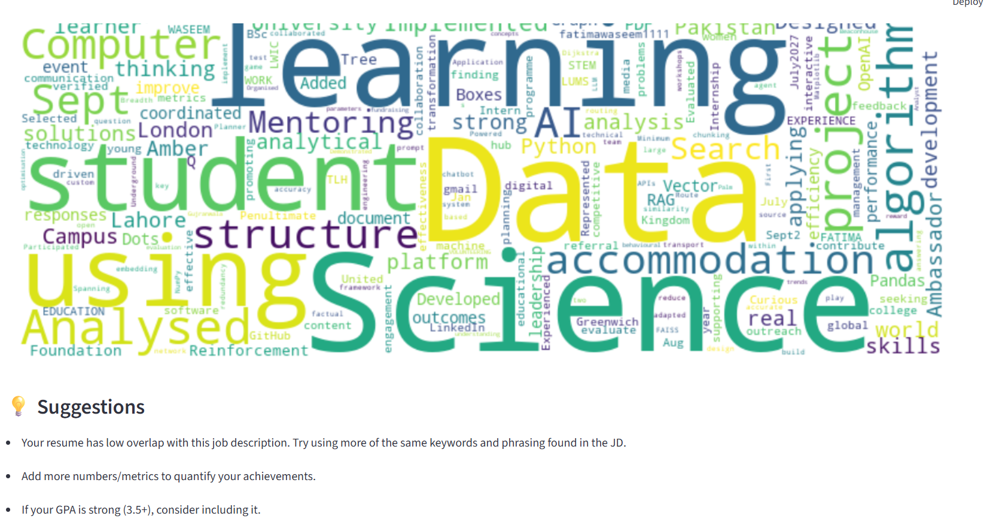

#  AI Resume Analyzer

An AI-powered resume analysis tool that compares a resume against a job description, scores the match using both classical NLP and deep learning techniques, and gives professional, ATS-style feedback — all running **completely offline**, with no paid API required.

Built as part of the Axorvian Internship Program (Task 3).

---

##  What It Does

Upload a resume (PDF) and paste in a job description, and the app will:

- Extract and clean the resume's text
- Extract skills from both the resume and the job description
- Show which required skills are **matched** and which are **missing**
- Calculate a match score using **two different NLP techniques**:
  - **TF-IDF + Cosine Similarity** (keyword-based)
  - **Sentence Transformers** (meaning-based / semantic similarity)
- Score the resume on three pillars, similar to real Applicant Tracking Systems (ATS):
  - **Content Quality** — strong action verbs, quantified achievements
  - **Formatting** — required sections present, contact info complete
  - **Keyword Match** — relevance to the specific job description
- Check for standard resume sections (Experience, Education, Skills)
- Check for weak/passive phrasing vs. strong action verbs
- Check for missing contact information (email, phone, LinkedIn)
- Give student-specific tips (Projects, Certifications, GPA)
- Visualize everything with a gauge chart, skills bar chart, and resume keyword word cloud
- Generate specific, actionable suggestions for improving the resume

---

##  Demo

Run locally with Streamlit — see [Installation](#-installation--setup) below.


---

##  Tech Stack

| Category | Tools Used |
|---|---|
| Language | Python 3 |
| Web Framework | [Streamlit](https://streamlit.io/) |
| PDF Parsing | pdfplumber |
| Classical NLP | scikit-learn (TF-IDF, Cosine Similarity) |
| Deep Learning NLP | sentence-transformers (`all-MiniLM-L6-v2`) |
| Visualization | Plotly, Matplotlib, WordCloud |
| Text Processing | Python `re` (regular expressions) |

No OpenAI, no Gemini, no external API keys required — the entire analysis engine runs locally.

---

## 📁 Project Structure

```
resume-analyzer/
│
├── app.py                     # Main Streamlit application (UI)
├── requirements.txt           # Python dependencies
├── README.md                  # This file
│
├── data/
│   ├── __init__.py
│   └── skills_list.py         # Master reference list of known skills
│
└── utils/
    ├── __init__.py
    ├── extract_text.py        # PDF text extraction
    └── analyzer.py             # Core NLP analysis + scoring engine
```

**How it fits together:** `app.py` is the only file that runs directly — it collects user input and displays results. It calls functions from `extract_text.py` (reads the PDF) and `analyzer.py` (does all scoring/analysis), which in turn pulls its reference vocabulary from `skills_list.py`.

---

## ⚙️ Installation & Setup

### 1. Clone the repository
```bash
git clone <your-repo-url>
cd resume-analyzer
```

### 2. Create a virtual environment
```bash
python -m venv venv
```

Activate it:
- **Windows:** `venv\Scripts\activate`
- **Mac/Linux:** `source venv/bin/activate`

### 3. Install dependencies
```bash
pip install -r requirements.txt
```

If you don't have a `requirements.txt` yet, install directly:
```bash
pip install streamlit pdfplumber scikit-learn pandas sentence-transformers plotly matplotlib wordcloud
```

### 4. Run the app
```bash
streamlit run app.py
```

The app will open automatically at `http://localhost:8501`.

> **Note:** on first run, `sentence-transformers` will download its model weights (a one-time download, then cached). This may take 30–60 seconds the very first time.

---

## 🧠 AI / NLP Techniques Used

| Technique | Purpose |
|---|---|
| **Text Preprocessing** | Lowercasing, punctuation stripping, whitespace normalization |
| **Keyword Extraction** | Matching resume/JD text against a curated skills taxonomy |
| **TF-IDF Vectorization** | Statistical keyword-importance scoring |
| **Cosine Similarity** | Measures closeness between TF-IDF and embedding vectors |
| **Sentence Embeddings (Transformers)** | Captures *meaning*, not just word overlap, for semantic match scoring |
| **Regex Pattern Matching** | Detects emails, phone numbers, and quantifiable achievements (numbers/%) |
| **Rule-Based Scoring** | Weighted 3-pillar scoring (Content 35% / Format 25% / Keywords 40%) |

---

## 📊 How the Match Score Works

```
Final Match Score = (TF-IDF Score × 0.3) + (Semantic Score × 0.7)

Overall Professional Score = (Content Score × 0.35)
                            + (Format Score × 0.25)
                            + (Keyword Score × 0.4)
```

This blended, multi-pillar approach mirrors how real commercial ATS platforms evaluate resumes — not just on keyword overlap, but on writing quality and structural completeness too.

---

## 🚧 Challenges Faced & Solutions

- **`streamlit run` vs. the IDE's Run button** — Streamlit apps must be launched via `streamlit run app.py` in a terminal, not run as a plain Python script, since Streamlit needs its own server process to manage the UI.
- **Deprecated Gemini library / API key format changes** — the original plan used the OpenAI and Gemini APIs, but ran into a deprecated `google-generativeai` package and shifting key formats. The project was pivoted to a fully offline NLP pipeline (TF-IDF + Sentence Transformers) for full reliability with zero external dependencies.
- **Import path & case-sensitivity issues** — Python import statements are case-sensitive; folder/file naming had to be kept consistent (`data`, not `Data`; `skills_list.py`, not `skill_list.py`).
- **Stale Python bytecode cache** — occasionally required clearing `__pycache__` folders after major edits to force Python to reload the latest code.
- **PDF font metadata warnings** — some resume PDFs (exported from certain templates) produce harmless `FontBBox` warnings during text extraction; these don't affect functionality.

---

## 🎓 Project Motive

Automated resume screening (ATS) tools are widely used by employers, but individual job seekers — especially students — rarely have access to the same kind of feedback before they apply. This project exists to close that gap: giving anyone a free, private, locally-run tool that evaluates their resume the way a real screening system would, with no account, no API key, and no cost.

---

## 📌 Future Improvements

- Batch analysis of multiple resumes against one job description
- Downloadable PDF report of results
- Named Entity Recognition (spaCy) for automatic name/education/experience extraction
- Support for `.docx` resumes in addition to PDF

---

## 👤 Author

Built by Fatima as part of the Axorvian Internship Program — Task 3: AI Resume Analyzer.

## 📄 License

This project is for educational purposes as part of an internship submission.